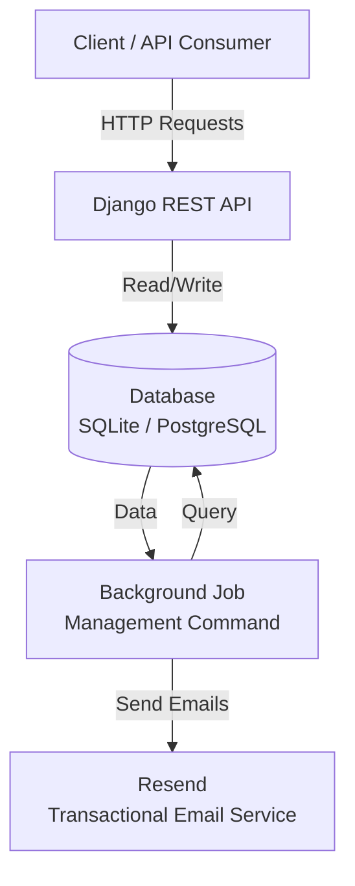
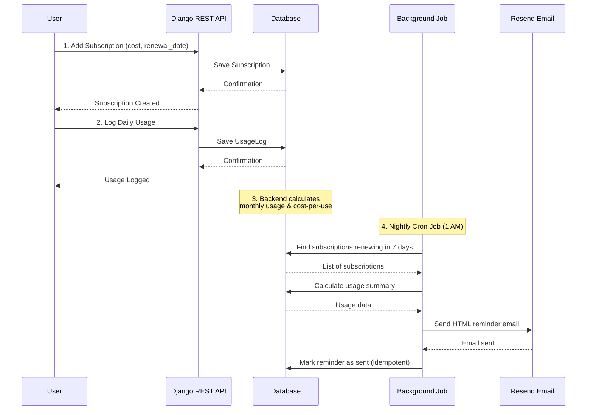
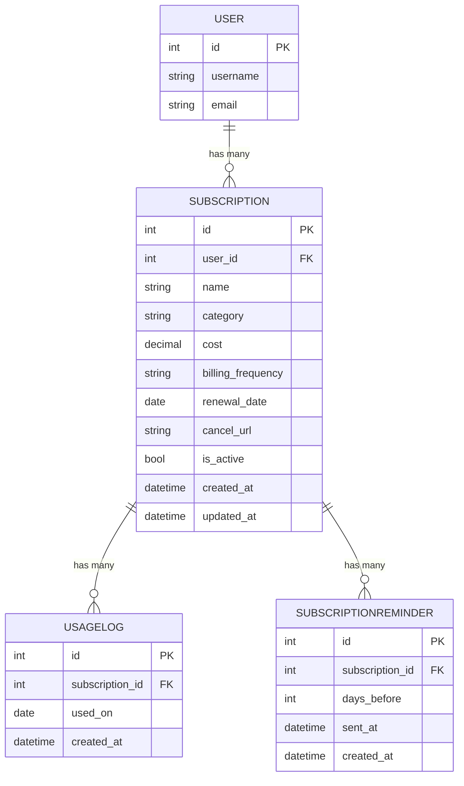

# 📊 Did I Actually Use This?

A backend-focused project that helps users stop wasting money on unused subscriptions by tracking usage, calculating cost-per-use, and sending smart renewal reminders before subscriptions renew.

---

## 🚀 What This Project Does

Most subscription trackers only show **how much you spend**, not **whether it was worth it**.

**Did I Actually Use This?** focuses on **usage-based awareness**:

- Track subscriptions manually (privacy-first)
- Log daily usage
- Calculate cost-per-use
- Identify wasted subscriptions
- Send **usage-aware renewal reminder emails** 7 days before renewal

---

## ✨ Features

- Subscription management (cost, category, renewal date)
- Daily usage logging per subscription
- Analytics:
  - Monthly spend
  - Cost-per-use
  - Unused (“wasted”) subscriptions
- Automated renewal reminders (7 days before renewal)
- HTML + plain-text transactional emails
- Nightly background job using Linux cron
- JWT authentication

---

## 🧠 Architecture Overview



### System Components Flow


### Key Design Principles

- Separation of business logic and delivery
- Idempotent background jobs (safe re-runs)
- Backend-first, frontend-agnostic design
- No bank integrations or auto-tracking (privacy-first)

---

## 🔄 Core Flow



### Step-by-Step Process

1. **User adds a subscription** with renewal date and cost
2. **User manually logs usage** per day
3. **Backend calculates** monthly usage & cost-per-use
4. **Nightly cron job runs**:
   - Finds subscriptions renewing in 7 days
   - Generates usage summary
   - Sends HTML reminder email
   - Marks reminder as sent (prevents duplicates)

---

## ⏰ Background Jobs & Scheduling

Renewal reminders are processed using a **Django management command**:

```bash
python manage.py send_renewal_reminders
```

Scheduled via Linux cron:

```bash
0 1 * * * /path/to/venv/bin/python /path/to/manage.py send_renewal_reminders
```

### Why cron (not Celery)?

- ✅ Simple and reliable
- ✅ No extra infrastructure
- ✅ Ideal for daily batch jobs
- ✅ Easy to debug and monitor

## ✉️ Email System

- HTML emails designed using Stripo
- Plain-text fallback for deliverability
- Transactional delivery via Resend

> **Note:** Gmail SMTP was intentionally replaced due to spam blocking of automated HTML emails. Only the email delivery layer was swapped — all business logic remained unchanged.

### 📧 Email Preview

Below is a real HTML renewal reminder email sent by the system using Resend:

This email is:
- Generated dynamically using Django templates
- Usage-aware (shows monthly usage & cost)
- Sent automatically via a scheduled background job

## 🧩 Data Models

### Database Relationship Diagram



### Model Details

#### Subscription
- `user` (ForeignKey to User)
- `name` (CharField, max 100 chars)
- `category` (Choices: entertainment, music, tools, games, education, other)
- `cost` (DecimalField, 10 digits, 2 decimal places - INR)
- `billing_frequency` (Choices: monthly, yearly, one-time, custom, trial)
- `renewal_date` (DateField)
- `cancel_url` (URLField, optional)
- `is_active` (BooleanField, default True)
- `created_at`, `updated_at` (DateTimeField, auto)

#### UsageLog
- `subscription` (ForeignKey to Subscription, related_name='usage_logs')
- `used_on` (DateField)
- `created_at` (DateTimeField, auto)
- **Constraint:** Unique per subscription per day (`unique_usage_per_day`)

#### SubscriptionReminder
- `subscription` (ForeignKey to Subscription, related_name='reminders')
- `days_before` (IntegerField)
- `sent_at` (DateTimeField, nullable)
- `created_at` (DateTimeField, auto)
- **Constraint:** Unique per subscription per `days_before` (ensures idempotent reminder delivery)

## 🛠️ Tech Stack

- **Backend:** Django, Django REST Framework
- **Auth:** JWT (Simple JWT)
- **Database:** SQLite (dev), PostgreSQL (prod-ready)
- **Email:** Resend (Transactional Email API)
- **Scheduling:** Linux cron
- **Templates:** HTML + Plain-text emails

## 🧠 Design & Learning Notes

While building this project, architecture and system flow were actively planned and reasoned about using Excalidraw.

🔗 **Design & flow diagrams:** [Excalidraw Link](https://excalidraw.com/#json=HP0Be-3xFQunGptdlaLlf,uVXU8IoiHFeApv0KHAVTiQ)

## 📌 Tradeoffs & Decisions

- ❌ **No auto-tracking** (manual usage is intentional)
- ❌ **No payment or bank integrations**
- ❌ **No scraping**
- ✅ **Privacy-first**
- ✅ **Backend reliability over feature bloat**

## 🔮 Possible Improvements

- Frontend dashboard (React)
- User notification preferences
- Multiple reminder windows (3 / 1 days)
- WhatsApp notifications
- Monthly PDF reports
- Unsubscribe handling

## ⭐ Why This Project

This project focuses on real backend engineering problems:

- Background jobs
- Email deliverability
- Idempotency
- Production constraints

It is intentionally not a CRUD demo.